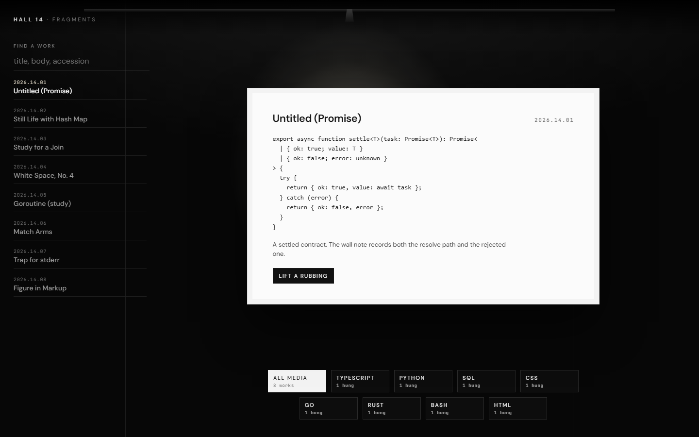

# snippet-vault

A local catalog of code fragments. The room is a **black gallery wall**: one white card sits in a spotlight, and languages hang as wall labels. Search the accession list, filter by medium, copy the work on view. The hanging lives in your browser (`localStorage`).

Not a kraft index-card desk. Not cream paper.

## How to run

Windows, from this folder:

```powershell
npm install
npm run dev
```

Open [http://localhost:3000](http://localhost:3000). Hall 14 should show a ceiling track, a cone of light, and **Untitled (Promise)** on the white card.

- Type in **Find a work** to filter titles, bodies, and accession numbers.
- Tap a language plaque to hang only that medium.
- **Lift a rubbing** copies the fragment to the clipboard.
- If local notes are corrupt, **Rehang the seed works** restores the original eight pieces.

```powershell
npm run build
npm start
```

## Layout

- `src/domain` — snippet, language tags, catalog search
- `src/data` — seed hanging and `localStorage` catalog
- `src/ui` — gallery wall, spotlight card, plaques

## Screenshot


