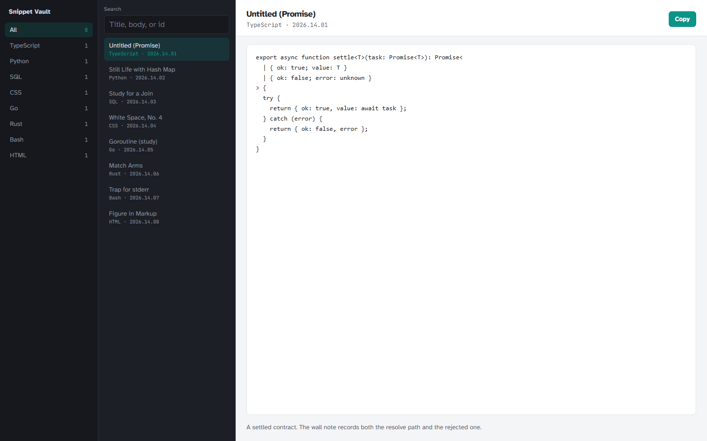

# snippet-vault

A local snippet manager: languages in a dark sidebar, a searchable list, and a light editor with copy. Snippets stay in your browser (`localStorage`).

## How to run

Windows, from this folder:

```powershell
npm install
npm run dev
```

Open [http://localhost:3000](http://localhost:3000). You should see **Snippet Vault** with **Untitled (Promise)** in the editor.

- Search titles, bodies, and ids.
- Filter by language in the left sidebar.
- **Copy** puts the snippet on the clipboard.
- If local data is corrupt, **Restore seed snippets** reloads the original eight.

```powershell
npm run build
npm start
```

## Layout

- `src/domain` — snippet, language tags, catalog search
- `src/data` — seed snippets and `localStorage` vault
- `src/ui` — language nav, snippet list, code pane

## Screenshot


